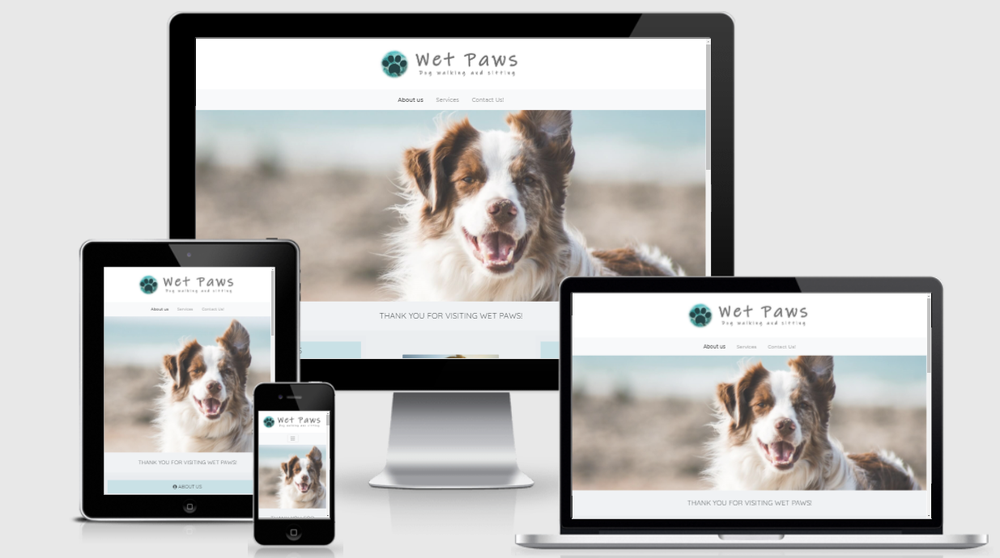
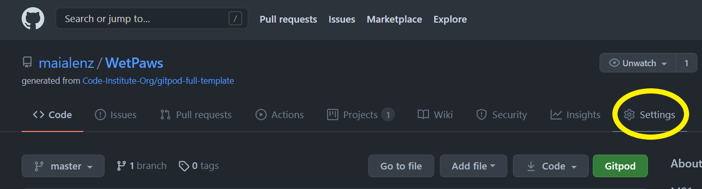
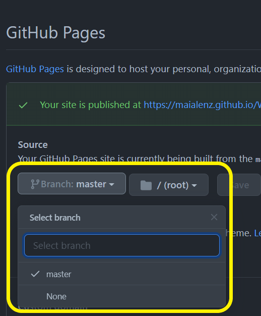
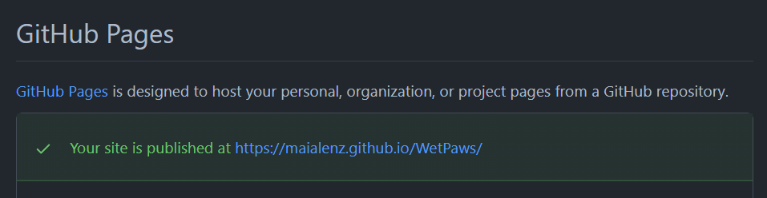
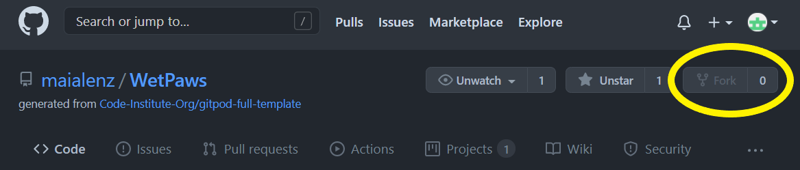
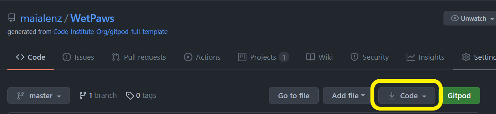
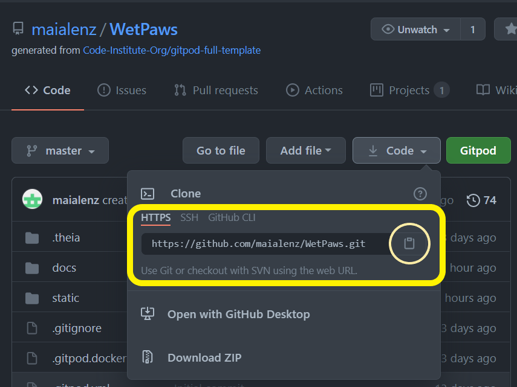

# **Wet Paws** | Dog Walking and Sitting Services

Milestone 1 Project - User-Centric Frontend Development



## Overview

This is a dog walking and sitting service page for a fictional company
who specialises in walking and dog sitting based in Bettystown, Ireland.

The website will be responsive and accessible on all devices with Mobile first
implementation on mind. The website will be visually enjoyable and easy to navigate,
with all the information the user needs clearly represented. It will be aimed for people
who wants answers fast and hasle free.

---

## Table of Contents

1. [UX](#ux)

- [User Stories](#user-stories)
- [Business Goals](#business-goals)
- [User Centered Design](#user-centered-design)
  - [Strategy plane](#strategy-plane)
    - [User needs](#user-needs)
    - [Technical capabilities](#technical-capabilities)
    - [Business vision](#business-vision)
  - [Scope plane](#scope-plane)
  - [Structure plane](#structure-plane)
  - [Skeleton plane](#Skeleton-plane)

2. [DESIGN](#design)

- [Color scheme](#color-scheme)
- [Typography](#typography)
- [Imagery](#imagery)
- [Logo](#logo)

3. [FEATURES](#features)

- [Existing Features](#existing-features)
- [Features left to implement](#features-left-to-implement)

4. [TECHNOLOGIES USED](#technologies-used)

- [Syntax](#syntax)
- [Frameworks, Libraries & Programs](#frameworks-libraries-&-programs)

5. [TESTING](#testing)

- [Testing document](TESTING.md)

6. [DEPLOYMENT](#deployment)

- [GitHub Pages](#github-pages)
- [Forking the repository](#forking-the-repository)
- [Cloning the repository](#cloning-the-repository)

7. [CREDITS](#credits)

- [References](REFERENCES.md)

8. [ACKNOWLEDGEMENTS](#acknowledgements)

## UX

### **User stories**

- As a visiting user I want to:
  - Find out what the company is about.
  - Easily visualize and understand what services the company offers.
  - Be able to use and book one or more services the company has to offer.
  - Be able to use the contact form for the business and service enquiries.
  - Have the option to personalize the services offered.
  - Feel that the company cares and I can trust them caring for my loved dog by seeing other people's reviews.
  - Be able to know more about the owner by having the option to personally meet them.
  - Know the location of the business and know where those services are offered.
  - Get in touch with the business easily by having contact details clearly available.
  - Be able to book a service quickly by having a direct tab to the contact form.
  - Find social links to be able to follow the business in social media platforms.

### **Business goals**

- The main goal of this business is to provide a dog sitting and walking service to users that are not able or need help to do keep their pets happy and healthy.
  It also wants to help people in need of help with their dogs because they have fallen sick or due to new working-from-home arrangements.

- The business wants to offer services to make sure that all dogs are given very loving care and treatment as if they were in their own home,
  while the owner is away/unavailable.

- Ideally all users that choose a service they would become regular users of one or more services provided by the business, since this is
  an essential need for any person/family that own a pet. If a person/family is happy with the service provided they will choose to book a service
  for a longer period of time and more often, making the business very trusted and the go-to one in the local area.

- A long term goal of the business is to create a well-known pet sitting company in the local area so it can have the option to expand to offer
  more tailored services withing the local and the surrounding areas with posibility of expantion to nationwide pet sitting company.

---

## USER CENTERED DESIGN

### **Strategy Plane**

- #### User needs

The needs of the user is to find a person to look after their family dog the same way they would during a short period or longer period of time
because they are not able to do so.

As the recent pandemic has forced many of us confined to our homes when it comes to work, sickness, etc, many of us have found ourselves having less
time than before when it comes to give the attention that our loved dogs need. This has created a need to find someone to help us giving our dogs some
normality and extra exercice on these times that are also stressful for our pets. Some dogs have become extra sensitive and emotional, or extra hyper with
extra need for longer walks.

- #### Technical capabilities

  - To use this site the user needs to have access to some internet connection within their chosen device.

  - They also need to have basic knowledge of how to search within a browser and very basic understanding on how to select and navigate
    the page.

  - This page can be done with Bootstrap framework to create a structure and implement sections that the user needs. The website's
    information will be kept separated in 3 different pages but easy to find and accessible so the user doesn't need to click more than 3 times to
    get to the page they need. It was not posible to add a live time booking on this project due to lack of skills, but would be implemented on a future
    release once the creator of the site gained more skills and knowledge.

- #### Business Vision

The purpose of this project is to create a business to give a personal service to all dog owners that need help walking or dog sitting (within their own homes
or the business owner's home) for a shor or long period of time, ensuring that the dog is loved and cared the same way as their owners would do. The business
also intend to give extra help to those people who has fallen ill with Covid and are struggling to look after their loved dog.

---

### **Scope plane | Trade-offs**

- **Features within the design plan with highest priority:**

  - Responsive navigation bar.

  - Navigation bar situated on the top of the page with buttons aligned in the middle to see the pages clearly and as expected by the user.

  - Following [Bootstrap](https://getbootstrap.com/) grid system with the layout of the site
    being mainly in thirds and halfs (col-6 col-4).

  - Footer containing business information and links to social media platforms.

  - A form page that contains radio buttons, required fields and text inputs.

- **Lower priority features that may not be including in the initial release of the website:**

  - Landing page with shortcuts to different pages within the website.

  - Map showing the exact location of the business.

  - A gallery of pictures showing dogs on the location of the business.

  - Navigation bar changing to a burger icon on smaller screen sizes.

---

### Structure Plane

- The structure of the site will be layed out in three pages to separate the different information and make easier for the user to go
  directly to the page they need without needing to scroll down too much to look for the information they are looking for.

- The layout will be organised in half or thirds depending on the page and the need to separate the information so it's shown on a tidy manner
  not to visually overload the user and allow them to see the information on one look.

- The landing page will be used as a shortcut to pages needed by returning users and frequent users to allow them to have a good user experience.

- In order to direct the user to the most important areas of the website, a navbar will be created on the top of the page to be easily located,
  including links to other section of the website.

- To ensure the users experience when completing the form for ordering is smooth, this page will contain
  minimal information and imagery to not distract the user.

- The footer will contain all the inportant information to contact the business's owners in other ways than filling the form. This will contain
  links to the different social media and "address" of the business.

---

### Skeleton Plane

- [Mobile Wireframe](docs/wireframes/Mobile.png)
- [Ipad Wireframe](docs/wireframes/Ipad.png)
- [Desktop Wireframe](docs/wireframes/Desktop.png)

## DESIGN

### **Colors**

The colors used in this project are inspired by the sea. Colors found at the location of the business, as this is located
on the seaside of Ireland. I will be using very light and minimal colors not to distract the user from the information and to make sure
there is a right contrast between the colors used in the background and the typography color.

The colors chosen are combinations of: pale/light blue and green, white and shades of grey. The color were found using
[Coolors](https://coolors.co/)

---

### **Typography**

The fonts used for the site were taken from [Google Fonts](https://fonts.google.com/). To make sure the information is not distracting and
difficult to read, it was decided to use simple but and consistent fonts previously used and seen in other projects within Code Institute like:

- "Roboto" (EDIT: it was chosen to be used as the body typography, but I chose not to use it at the end as "Montserrat" fit better)
- "Quicksand"
- "Montserrat"
- "Montserrat alternates" (for extra elegance and fun but used minimally not to break the flow of the information)

---

### **Imagery**

- The imagery will be very important on the site, as it's a way to create warmth and familiarity for the dog owners that use the site.

- The headers on all the pages will be the same hero image size but different images to create consistency but a separation between the different pages . The light navbar
  will be placed under the logo and above the hero image and will have three linkes to the respective pages. The reason for this is to be visually easy to find the links and to immediately direct the user to their selected part of the website.

- The imagery used in the website will be minimal and small in order to still keep the balance between aesthetic style and information consistent.

---

### **Logo**

- The logo for site was created using a combination of an online application called [Canva](https://www.canva.com/) and Paint. It has a a little paw logo with a background representing a very light blue sea
  provided by the website itself as part of the creation of the logo and it's a nod to the name of the business itself (WET Paws). It was designed in a simple way to represent the reason to be of the business (dog paw) and the name
  of the business (Wet Paws).

---

## FEATURES

### Existing Features

- The site will be responsive for most screen sizes

- **Header:** it will be repeated in all the pages for consistency and good user experience

  - Navbar:
    - It'll include a link to the three other pages in the site. The link will increase on size when hovered over it.
    - in smaller screens the navbar will change to a clickable burger with collapsed menu with nav-links to the other pages
    - slight change of color on the links when hovered over the buttons
    - Will have a logo representing the company and it's name linked to the home page for easy return.

- **Body:** will differ depend on the page
  - Home page (About Us):
    - A section with information about the company's owners and a meeting information for those wanted to meet the owner personally.
    - A picture of the owner's dog to familiarize with them.
    - A section with a static but responsive gallery with dog pictures and the owners pictures. This would be a section for a future gallery slideshow with customer dog pictures.
    - A section with a playlists from spotify for enjoyment of the user.
    - A section with a map to point the location of the business.
  - Services:
    - A section divided in four cards to show the different services the company offers with a brief description of them and links
      to the content form page for the posibility to contact the owner or book a service.
    - A section with boxes to display reviews of customers who already used one or more services, containing
      pictures of dogs previously cared for to give a real and trust inducing reviews.
  - Contact form:
    - Must fields will be required so the business can offer a more personalised service to the user sending a business
      inquiry.
    - will require to fill fields of Name, Surname, dog's name, email adress (to be able to contact the user querie),
      service type to enquire about and a text input field for further information to be asked to the company.
    - A call to action button to send the information to the company, linked to another page with feedback regarding their submition.
- **Footer:** it will be repeated in all the pages for consistency and good user experience
  - Social Links:
    - Linked icons to social media platforms.
    - They'll open in a separate blank page for the users' comfort.
    - Color changing hover feature for
  - Owners name and email address
  - Contact details

---

### Features left to implement

- Gallery slideshow : due to the lack of knowledge on JavaScript and jQuery and the short time frame for the project to be done, I decided to leave the Gallery slideshow feature out for the time being. The gallery slideshow would be incorporated once I had a wider customer directory and longer period to implement this feature. In the first release the small gallery will consist on small selection of responsive pictures, but they won't be clickable.

- Booking calendar: I decided to leave the calendar for booking preference out because I do not have the skills required to implement this feature.

- Live chat: in a future I would like to add a section to be able to chat directly with the sitter/owner to ask questions instead of filling a form every time. I leave this feature out due to lack of current skills.

- Submit button: linked to a modal or an external page giving the user feedback about their submitted form. Unfortunatelly, due to the issues I had with an ERROR 501 (see Bugs section on [TESTING.md](testing.md) for more information about this), I had to make the decission of leaving this feature outside the scope for the first release and focus on the rest of the features and their responsiveness.

- Original pictures: due to the low quality but very heavy pictures taken by me, I had to change most pictures to ones taken from unsplash to improve performance of the site. In a future, all pictures on the gallery would be originals and taken of dogs under our care and services.

---

## TECHNOLOGIES USED

### Syntax

- HTML5:
  - HTML5 is a markup language used for structuring and presenting content on the internet.
- CSS:
  - Cascading Style Sheets (CSS) is a style sheet language used for describing the presentation of a document written in a markup language such as HTML
- Markup (for README.md, REFERENCES.md and TESTING.md)

### Frameworks, Libraries & Programs

- Bootstrap
  - library: used to load the framework into my workspace.
  - documentation: used as a reference on how to use Bootstrap library and it's components.
- JavaScript library:
  - used to make sure the Bootstrap libraries loaded and worked
- jQuery:
  - used to make sure the Bootstrap libraries loaded and worked
- [Balsamiq Wireframes](https://balsamiq.com/wireframes/?gclid=Cj0KCQiAyoeCBhCTARIsAOfpKxhC8AjxQ7KoW7lWyaSISWg3cKgb1Zj7nCRe4K69pf4SD8brerOufBgaAnPHEALw_wcB)
  - used to create the projects wireframes. Verification code provided by Code Insitute for the duration of the course.
- Fontawesome
  - used to include inline icons as representation of the information
- Google fonts
  - used to give the typography a personal and styled character
- w3schools
  - used to refresh the lessons learned in the course in a summed up way
- Stack overflow
  - to find solutions to problems and bugs I encounter during the creation of the website
- [Hover.css Effects Demo Page](https://hovercss.pagecloud.com/)
  - used to add style to CTA buttons
- [TinyPNG](https://tinypng.com/)
  - used to reduce the weight on pictures gotten from Unsplash
- Pinterest:
  - for color, typography, picture, layout...inspiration during the planning of the project.
- [Unsplash](https://unsplash.com/)
  - used to get good quality pictures used as hero images and gallery
- [Pexels](https://www.pexels.com/)
  - used to get good quality pictures
- [Coolors](https://coolors.co/image-picker)
  - used to find colors that suit my website.
- [Colorhexa](https://www.colorhexa.com/)
  - used to find specific hex value of a colors:
    - #a4a4a4
    - #a0e0ca
- [Canva](https://www.canva.com/)
  - used to create the logo image
- Paint -by Microsoft
  - used to put together the logo image created with Canva and the name of the company.
- [Am I Responsive?](http://ami.responsivedesign.is/#)
  - used to create the Mockup image at the beginning of the README.md.

---

## TESTING

You can find all the information and documentation about the testing that
has been carried out [here](TESTING.md)

---

## DEPLOYMENT

### GitHub Pages

This project was built using the [GitPod](https://www.gitpod.io) environment, specifically in the cloud cloud. 1. To start using the new environment, first a new repository was created in GitHub called [WetPaws](https://github.com/maialenz/WetPaws) 2. All the commits and pushes made during the building process were made very often to keep the project save and updated.

The project was deployed using [GitHub Pages](https://pages.github.com/) using the following steps:

1. Log in to [GitHub](https://github.com/join/get-started) and locate the [GitHub repository](https://github.com/maialenz/WetPaws)

   - You can also find it by seaching maialenz/WetPaws on the [GitHub](https://github.com/) seach-bar.

2. Below the repository title at the top, find the "Settings" button on the horizontal or dropdown (small screens) menu



3. Scroll down the Settings page until you locate the "GitHub Pages" section.

4. Under the "Source" title, click on the dropdown button called "None" and change the source to "Master Branch".
   

5. The page will automatically refresh

6. When the loading is finished, scroll back down to the GitHub pages section where you will find the deployed [link](https://maialenz.github.io/WetPaws/) to the website.
   

---

### Forking the GitHub repository

It is posible to copy and edit this project by any user without changing the repository on the original GitHub account. This can be done by forking the repository by following the following steps (Forking will only make a copy of the original project, so any changes won't affect the original):

1. Log in to [GitHub](https://github.com/join/get-started) and locate the [GitHub repository](https://github.com/maialenz/WetPaws)

   - You can also find it by seaching maialenz/WetPaws on the [GitHub](https://github.com/) seach-bar.

2. Below the repository title at the top, above the "Settings" button on the horizontal menu and under the user's profile logo, locate the "Fork" button and click on it.
   

3. You will have made a copy of the whole repository in your own GitHub account.

4. To share the changes/edits you have made to improve the original project with the owner, you can submit a pull request.
   Find the details to do so following this [link](https://docs.github.com/en/github/collaborating-with-issues-and-pull-requests/creating-a-pull-request-from-a-fork).

---

### Making a Local Clone

1. Log in to [GitHub](https://github.com/join/get-started) and locate the [GitHub repository](https://github.com/maialenz/WetPaws)

   - You can also find it by seaching maialenz/WetPaws on the [GitHub](https://github.com/) seach-bar.

2. Above the repository files and to the left of the green "GitPod" button, locate the "Code" or "download" button and click on it.
   

3. To clone the repository using HTTPS copy the link on display (you can click on the clipboard to copy it faster).
   

4. If you are working on a desktop application, follow the documentation found on number 9. For cloud based, open your own terminal in GitPod.

5. Change the current working directory to the location where you want the cloned directory to be made.

6. In the terminal type `git clone` and then paste the URL copied on step 3

```
$ git clone https://github.com/YOUR-USERNAME/YOUR-REPOSITORY
```

7.Press Enter. This will create your local clone.

```
$ git clone https://github.com/YOUR-USERNAME/YOUR-REPOSITORY
> Cloning into `CI-Clone`...
> remote: Counting objects: 10, done.
> remote: Compressing objects: 100% (8/8), done.
> remove: Total 10 (delta 1), reused 10 (delta 1)
> Unpacking objects: 100% (10/10), done.
```

8. To open a preview port within your own local workspace type:

```
$ python3 -m http.server
```

9. If you use GitHub desktop follow the steps documented [here](https://docs.github.com/en/github/creating-cloning-and-archiving-repositories/cloning-a-repository#cloning-a-repository-to-github-desktop).

---

## CREDITS

### [REFERENCES](REFERENCES.md)

- More information about references used (parts of libraries, Stackoverflow...) to build this website can be found [here](REFERENCES.md)

---

### Images

- To [Jamie Street](https://unsplash.com/@jamie452)for the pictures used for the [gallery](https://unsplash.com/photos/EdlNaRhg9ik) in index.html and [hero image](https://unsplash.com/photos/UtrE5DcgEyg) contact.html taken from [Unsplash](https://unsplash.com/)

- To [Andrew Pons](https://unsplash.com/photos/oH9AuO20kbk) for the picture used for services.html taken from Unsplash

- To [Devon Divine](https://unsplash.com/@lightrisephoto) for the picture used in the [gallery](https://unsplash.com/photos/C2M7DWL2fDk) on Index.html taken from Unsplash

- To [Helena Lopes](https://unsplash.com/@wildlittlethingsphoto) for the picture used on the [gallery](https://unsplash.com/photos/Az-dc69psKQ) taken from Unsplash

- To [Richard Brutyo](https://unsplash.com/@richardbrutyo) for the picture used on the [gallery](https://unsplash.com/photos/Sg3XwuEpybU) taken from Unsplash

- To [Pauline Loroy](https://unsplash.com/photos/U3aF7hgUSrk) for the picture used as a hero image for Index.html taken from Unsplash

- To [Ralu Gal]() for the picture used for the fake review in services.html taken from Unsplash

- To [Ryan Walton](https://unsplash.com/@rwltn1)for the picture used for the fake [review](https://unsplash.com/photos/AbNO2iejoXA) in services.html taken from Unsplash

- To [Oscar Sutton](https://unsplash.com/photos/yihlaRCCvd4) for the picture used for the fake review in services.html taken from Unsplash

- To [Jay Wennington](https://unsplash.com/photos/w_O_tPgxvok) for the picture used for the fake review in services.html taken from Unsplash

---

### Music

- [Dog walking music Playlist](https://open.spotify.com/playlist/0z6dHFTpcCtTSwodlm6m6S?utm_source=embed_v2&go=1&play=1&nd=1) - List by user [Sonya Boyle](https://open.spotify.com/user/21sveimh7porwyktus2aro2ga)

- [Dog walking songs Playlist](https://open.spotify.com/playlist/37i9dQZF1DWTvNyxOwkztu?utm_source=embed_v2&go=1&play=1&nd=1) - List by user [lewisob1998](https://open.spotify.com/user/lewisob1998)

- [Chillout Lounge Playlist](https://open.spotify.com/playlist/37i9dQZF1DWTvNyxOwkztu?utm_source=embed_v2&go=1&play=1&nd=1) - List by Spotify

---

## ACKNOWLEDGEMENTS

- To Scott from Tutor support for trying to give me ideas on how to create a solution to send the user feedback once they sent the form.

- To Tim from Tutor support for helping me fixing my issues with the form submission and helping me get back on track when I was stuck on unachiavable goals.

- To Gerard McBride for all the saturdays spent giving us extra lessons to help us understand and perfect our code and use of the technologies. Thank you!

- To Pawshake.ie for giving me some real ideas at the begining of the planning, on how a pet sitting company should portray themselves and the type of services a dog sitting company offers in real life.

- To my family for testing the deployed site on different phones to make sure it was responsive in different type of screens and operator systems.

---

### Content

All content on this website is original, but it's content has been inspired and influenced by a real life company like
[Pawshake](https://www.pawshake.ie/) with similar services.

The pictures not taken from [Unsplash](https://unsplash.com/) were taken with a personal phone (Samsung Galaxy S8+) of the family dog.

---

### Disclaimer

This project is for educational use only. None of the products or services listed in this website are real or functional. Any resemblance to a posible real business in the same area is purely coincidental.

Sua was not harmed or forced in the making of this project. All pictures were taken using positive reinforcement and was happy to get many treats.

---

Project created by **Maialen Zumeta** | Bettystown - Ireland, March - April 2021
